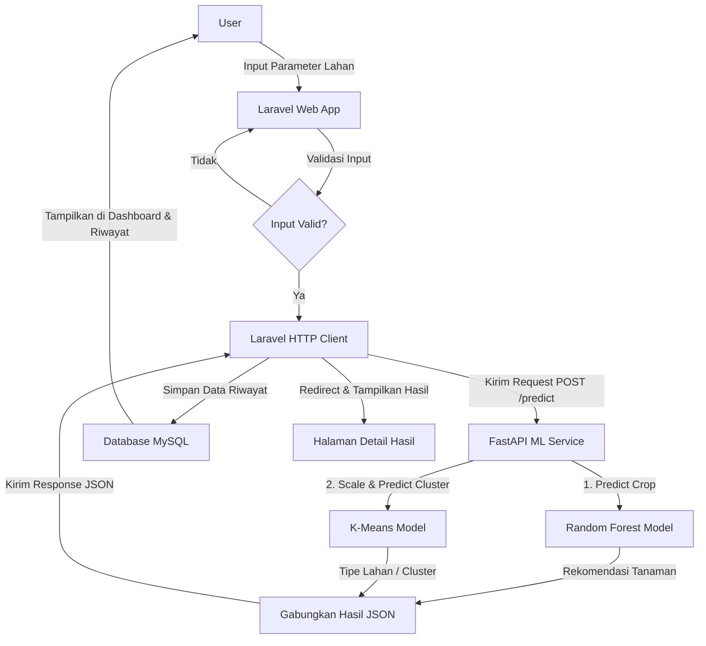
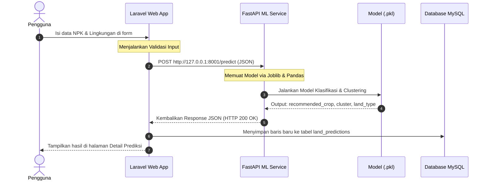

# Dokumentasi Pemahaman Project SmartFarm
Dokumentasi ini menyajikan informasi lengkap mengenai arsitektur, alur data, struktur kode, dan teknologi yang digunakan dalam project **SmartFarm Web App - Random Forest dan K-Means Crop Recommendation**. Dokumen ini ditujukan untuk memberikan gambaran menyeluruh tentang bagaimana sistem SmartFarm diimplementasikan dan dioperasikan.

---

## 1. Ringkasan Project

*   **Nama Aplikasi**: SmartFarm
*   **Tujuan Aplikasi**: Membantu pengguna (petani, peneliti, atau akademisi) untuk mendapatkan rekomendasi jenis tanaman terbaik serta segmentasi tipe lahan berdasarkan kandungan nutrisi tanah dan kondisi klimatologi lingkungan secara real-time.
*   **Masalah yang Diselesaikan**: Menghilangkan ketidakpastian dan kesalahan pemilihan jenis tanaman akibat penilaian manual yang subjektif. Aplikasi meminimalisir risiko gagal panen dengan memanfaatkan analisis presisi tinggi berbasis Machine Learning.
*   **Kenapa Smart Farming**: Karena mengintegrasikan teknologi informasi modern dan data hara tanah/lingkungan secara digital guna mengotomatisasi pengambilan keputusan pertanian presisi (*precision agriculture*).
*   **Hubungan dengan Project Data Mining**: Aplikasi web ini bertindak sebagai antarmuka pengguna (user interface) untuk menerapkan model Machine Learning yang telah dilatih. Model klasifikasi **Random Forest** (Supervised) digunakan untuk merekomendasikan tanaman, sedangkan model clustering **K-Means** (Unsupervised) digunakan untuk segmentasi tipe lahan.
*   **Teknologi yang Digunakan**: Laravel v11 (Backend & Frontend Web), MySQL (Database), FastAPI (REST API/ML Service), Python (Uvicorn, Joblib, Pandas, Scikit-learn).

---

## 2. Alur Umum Aplikasi

Aplikasi berjalan dengan alur sekuensial interaktif sebagai berikut:
1.  **User membuka aplikasi** dan mendarat di Landing Page.
2.  **User melakukan login** (atau mendaftar akun baru jika belum memiliki).
3.  Setelah login, **User masuk ke Dashboard** yang menampilkan ringkasan data, riwayat terkini, dan pintasan menu.
4.  **User membuka menu "Analisis Baru"** untuk memasukkan kondisi lahan.
5.  **User mengisi parameter input** tanah & lingkungan:
    *   Nutrisi Makro Tanah: Nitrogen (N), Phosphorus (P), Potassium (K).
    *   Klimatologi/Lingkungan: Suhu (°C), Kelembaban (%), Keasaman (pH), Curah Hujan (mm).
6.  **Laravel menerima request** form submission dan melakukan **validasi input** secara ketat.
7.  **Laravel HTTP Client** mengirimkan payload data input (dalam format JSON) ke **FastAPI ML Service**.
8.  **FastAPI mengeksekusi model ML**:
    *   Memasukkan data ke model **Random Forest** -> Mengembalikan hasil prediksi tanaman.
    *   Memasukkan data ke model **K-Means** -> Melakukan penskalaan data (scaling) dan menentukan cluster serta tipe lahan.
9.  **FastAPI mengembalikan response JSON** berisi tanaman rekomendasi, ID cluster, dan deskripsi tipe lahan ke Laravel.
10. **Laravel menangkap response** dan menyimpannya sebagai baris riwayat baru ke database MySQL.
11. **Laravel mengarahkan user** ke halaman detail hasil prediksi untuk menampilkan rekomendasi tanaman dan interpretasi lahan secara visual.
12. **User dapat mengelola riwayat** dengan melakukan modifikasi data (Update) atau penghapusan data (Delete).

### Diagram Alur Sistem (Mermaid)



---

## 3. Teknologi yang Digunakan

Berikut adalah daftar teknologi yang membentuk ekosistem SmartFarm:

| Teknologi | Peran dalam Project | Keterangan |
| :--- | :--- | :--- |
| **Laravel v11** | Web Framework Utama | Mengelola routing, keamanan, validasi, otentikasi, basis data, dan rendering UI. |
| **FastAPI** | Service Machine Learning | Framework Python berkinerja tinggi untuk melayani prediksi ML secara RESTful. |
| **Blade** | Templating Engine | Membuat antarmuka pengguna yang dinamis dan modular di sisi Laravel. |
| **Tailwind CSS v4** | CSS Styling | Framework CSS utilitas untuk merancang desain antarmuka modern, interaktif, dan responsif. |
| **MySQL** | Relational Database | Menyimpan data otentikasi user dan riwayat parameter prediksi hara tanah. |
| **Laravel Breeze** | Starter Kit Autentikasi | Menyediakan boilerplate siap pakai untuk Register, Login, Logout, dan Profile. |
| **Random Forest** | Model ML (Supervised) | Memprediksi kecocokan jenis tanaman berdasarkan data berlabel. |
| **K-Means** | Model ML (Unsupervised) | Mengelompokkan jenis lahan berdasarkan parameter input lingkungan. |
| **Hugeicons** | Library Ikon | Memberikan koleksi ikon stroke modern bertema pertanian/dashboard. |

---

## 4. Laravel sebagai Web Framework Utama

Aplikasi web ini diposisikan dengan **Laravel sebagai pusat kendali utama (core application)**, sedangkan FastAPI bertindak sebagai mikroservis pendukung (*supporting service*). 
*   **Keamanan & Akses**: Laravel menangani otentikasi pengguna secara aman, membatasi akses halaman rahasia melalui middleware, dan melindungi form dari serangan CSRF.
*   **Manajemen Data**: Laravel mengelola penuh database MySQL melalui migrasi skema tabel dan interaksi data menggunakan ORM Eloquent.
*   **Integrasi Model**: Laravel tidak menjalankan model machine learning secara langsung karena keterbatasan ekosistem PHP. Sebagai gantinya, Laravel berinteraksi dengan API eksternal (FastAPI) menggunakan HTTP Client bawaan. Jika service FastAPI mati, Laravel menangani *fallback* secara elegan sehingga aplikasi tidak mengalami *crash*.

---

## 5. Struktur Folder Penting

Sesuai dengan repositori monorepo ini, berikut adalah tabel letak berkas-berkas penting:

| Bagian | Lokasi File/Folder | Fungsi |
| :--- | :--- | :--- |
| **Routing Web** | [routes/web.php](file:/smartfarm/smartfarm-laravel/routes/web.php) | Mengatur URL halaman publik dan URL fitur CRUD yang dilindungi auth. |
| **Routing Auth** | [routes/auth.php](file:/smartfarm/smartfarm-laravel/routes/auth.php) | Mengatur URL login, register, reset password, dan logout (Breeze). |
| **Controller Utama** | [LandPredictionController.php](file:/smartfarm/smartfarm-laravel/app/Http/Controllers/LandPredictionController.php) | Berisi logika dashboard, validasi form, request ke FastAPI, dan CRUD data. |
| **Model User** | [User.php](file:/smartfarm/smartfarm-laravel/app/Models/User.php) | Merepresentasikan tabel `users` dan mendefinisikan relasi ke `LandPrediction`. |
| **Model Prediksi** | [LandPrediction.php](file:/smartfarm/smartfarm-laravel/app/Models/LandPrediction.php) | Merepresentasikan tabel `land_predictions` beserta properti `$fillable`. |
| **Migration Database** | [2026_06_25_000000_create_land_predictions_table.php](file:/smartfarm/smartfarm-laravel/database/migrations/2026_06_25_000000_create_land_predictions_table.php) | Menentukan skema kolom database riwayat prediksi (N, P, K, dll.). |
| **Seeder Default** | [DatabaseSeeder.php](file:/smartfarm/smartfarm-laravel/database/seeders/DatabaseSeeder.php) | Menyediakan data dummy untuk mempermudah login (`test@example.com`). |
| **Views UI** | `resources/views/...` | Direktori berkas template antarmuka HTML/Blade. |
| **Konfigurasi Env** | `smartfarm-laravel/.env` | Tempat menyimpan rahasia sistem, koneksi database, dan URL FastAPI. |
| **FastAPI Core** | [main.py](file:/smartfarm/ml-service/main.py) | Script utama Python yang memuat model `.pkl` dan membuka endpoint API. |
| **File Model ML** | `ml-service/*.pkl` | Serialisasi model Random Forest & K-Means yang siap dimuat oleh Joblib. |

---

## 6. Penjelasan Routing

Daftar rute URL utama yang didefinisikan dalam web app Laravel SmartFarm:

| Method | URL / Route | Controller / Fungsi | Middleware | Penjelasan |
| :--- | :--- | :--- | :--- | :--- |
| **GET** | `/` | *Closure (Inline)* | `guest` / None | Landing page aplikasi (informasi profil, model ML, cara kerja). |
| **GET** | `/login` | `AuthenticatedSessionController@create` | `guest` | Menampilkan form login. |
| **POST** | `/login` | `AuthenticatedSessionController@store` | `guest` | Memproses otentikasi login user. |
| **POST** | `/logout` | `AuthenticatedSessionController@destroy` | `auth` | Memproses keluar sistem dan menghapus session. |
| **GET** | `/dashboard` | `LandPredictionController@dashboard` | `auth` | Menampilkan halaman dashboard ringkasan statistik user. |
| **GET** | `/predictions` | `LandPredictionController@index` | `auth` | Menampilkan halaman daftar riwayat prediksi user. |
| **GET** | `/predictions/create` | `LandPredictionController@create` | `auth` | Menampilkan form input parameter tanah baru. |
| **POST** | `/predictions` | `LandPredictionController@store` | `auth` | Memvalidasi input, menghubungi FastAPI, dan menyimpan ke DB. |
| **GET** | `/predictions/{id}` | `LandPredictionController@show` | `auth` | Menampilkan detail hasil analisis (rekomendasi tanaman & tipe lahan). |
| **GET** | `/predictions/{id}/edit` | `LandPredictionController@edit` | `auth` | Menampilkan form edit data parameter tanah lama. |
| **PUT** | `/predictions/{id}` | `LandPredictionController@update` | `auth` | Memvalidasi input, re-predict ke FastAPI, dan memperbarui DB. |
| **DELETE**| `/predictions/{id}` | `LandPredictionController@destroy` | `auth` | Menghapus baris riwayat prediksi tertentu secara permanen. |

> **Catatan**: Semua route penting untuk fitur utama aplikasi dibungkus oleh middleware `auth` guna memastikan hanya pengguna yang telah login yang dapat mengelola data prediksi mereka sendiri.

---

## 7. Penjelasan Controller

Logika kontroler berpusat pada [LandPredictionController.php](file:/smartfarm/smartfarm-laravel/app/Http/Controllers/LandPredictionController.php). Berikut adalah rincian fungsionalitas tiap metodenya:

*   **`dashboard()`**:
    *   Mengambil ID user yang sedang login menggunakan `auth()->id()`.
    *   Menghitung jumlah total baris prediksi milik user tersebut.
    *   Mengambil data 5 prediksi terakhir untuk ditampilkan di tabel ringkasan dashboard.
    *   Mengambil rekomendasi tanaman terakhir yang sukses diprediksi.
    *   Mengembalikan view `dashboard` bersama variabel data ringkasan.
*   **`index()`**:
    *   Mengambil seluruh riwayat prediksi milik user bersangkutan diurutkan dari yang terbaru (`latest()`).
    *   Mengembalikan view `predictions.index`.
*   **`create()`**:
    *   Hanya mengembalikan view form input baru `predictions.create`.
*   **`store(Request $request)`**:
    *   Melakukan validasi input form menggunakan `$request->validate()`.
    *   Membaca URL target FastAPI dari konfigurasi (`services.fastapi.url`).
    *   Mengirim data ke FastAPI menggunakan `Http::timeout(5)->post($apiUrl, $payload)`.
    *   Jika request API gagal/mati, menangkap error melalui blok `catch (\Exception $e)` atau pengecekan `$response->failed()` dan mengembalikan user kembali ke form dengan membawa pesan `api_error`.
    *   Jika sukses, menyimpan data input beserta output FastAPI ke database melalui relasi user `auth()->user()->landPredictions()->create(...)`.
    *   Mengalihkan (redirect) halaman ke detail riwayat (`predictions.show`) dengan flash message sukses.
*   **`show($id)`**:
    *   Mencari record prediksi milik user terkait berdasarkan ID. Jika tidak ditemukan, otomatis melempar error 404 (`findOrFail`).
    *   Mengembalikan view `predictions.show`.
*   **`edit($id)`**:
    *   Mencari record prediksi, lalu mengembalikan view form edit `predictions.edit` dengan data lama sebagai nilai bawaan (*pre-filled*).
*   **`update(Request $request, $id)`**:
    *   Memvalidasi input baru.
    *   Mengirim ulang data ke FastAPI untuk memperbaharui hasil prediksi.
    *   Memperbarui baris data di database dengan method Eloquent `update()`.
    *   Redirect ke halaman detail prediksi dengan pesan sukses.
*   **`destroy($id)`**:
    *   Mencari record prediksi terkait, menghapusnya dari database dengan method `delete()`.
    *   Redirect kembali ke riwayat (`predictions.index`) dengan pesan sukses.

---

## 8. Penjelasan Model dan Database

Aplikasi memiliki dua Model utama yang saling berhubungan:

### 8.1 Model `User` (`app/Models/User.php`)
*   Merepresentasikan tabel bawaan `users`.
*   Memiliki relasi **One-to-Many** ke `LandPrediction`. Ditulis dengan fungsi:
    ```php
    public function landPredictions() {
        return $this->hasMany(LandPrediction::class);
    }
    ```
    *Artinya: Satu pengguna dapat memiliki banyak data riwayat analisis lahan.*

### 8.2 Model `LandPrediction` (`app/Models/LandPrediction.php`)
*   Merepresentasikan tabel `land_predictions`.
*   Mendefinisikan kolom yang boleh diisi secara massal lewat properti `$fillable` (N, P, K, temperature, humidity, ph, rainfall, recommended_crop, cluster, land_type).
*   Memiliki relasi balik **BelongsTo** ke `User` untuk mengidentifikasi kepemilikan data:
    ```php
    public function user() {
        return $this->belongsTo(User::class);
    }
    ```

### 8.3 Skema Tabel Database (`land_predictions`)
Dibuat melalui file migration Laravel dengan detail kolom sebagai berikut:
*   `id` (Big Integer, Primary Key, Auto Increment)
*   `user_id` (Foreign Key terhubung ke tabel `users`, dengan opsi `cascadeOnDelete` - jika user dihapus, data prediksinya ikut terhapus)
*   `N`, `P`, `K` (Float - menyimpan kandungan unsur hara makro tanah)
*   `temperature`, `humidity`, `ph`, `rainfall` (Float - menyimpan data klimatologi/lingkungan)
*   `recommended_crop` (String, nullable - menyimpan nama tanaman rekomendasi hasil Random Forest)
*   `cluster` (Integer, nullable - menyimpan index cluster hasil K-Means)
*   `land_type` (String, nullable - menyimpan deskripsi segmentasi lahan hasil K-Means)
*   `timestamps` (Menghasilkan kolom `created_at` dan `updated_at`)

---

## 9. Penjelasan CRUD

Operasi manipulasi data (CRUD) diimplementasikan secara penuh pada entitas Prediksi Lahan:

```
[User Mengisi Form] 
       ↓
[Laravel Validasi Parameter] 
       ↓
[Kirim ke FastAPI ML Service]
       ↓ (Menerima Prediksi & Cluster)
[Eloquent Model Simpan / Edit di DB]
       ↓
[Redirect & Tampilkan Flash Message Sukses]
```

*   **Create (Tambah Data)**: Dilakukan di menu *Analisis Baru* (`predictions/create.blade.php`), ditangani oleh method `store()`. Pengguna memasukkan data numerik hara/klimatologi, sistem meminta prediksi ke FastAPI, lalu menyimpannya ke MySQL.
*   **Read (Tampil Data)**:
    *   **Daftar Riwayat** (`predictions/index.blade.php`): Menampilkan daftar riwayat pengujian dalam bentuk tabel tabular terstruktur yang rapi, lengkap dengan info tanggal dan waktu.
    *   **Detail Analisis** (`predictions/show.blade.php`): Menampilkan rincian visual hasil rekomendasi tanaman (dengan hiasan tipografi serif miring), klasifikasi tipe lahan, serta progress bar komposisi NPK dan widget data klimatologi.
*   **Update (Ubah Data)**: Halaman *Edit Data* (`predictions/edit.blade.php`), ditangani oleh method `update()`. Memungkinkan pengguna mengoreksi data masukan lama. Sistem akan menembak ulang API FastAPI untuk memperbarui hasil prediksi tanaman dan cluster di database.
*   **Delete (Hapus Data)**: Ditangani oleh method `destroy()`. Halaman dilindungi oleh modal konfirmasi interaktif (menggunakan Alpine.js di Breeze) agar mencegah penghapusan data secara tidak sengaja.

---

## 10. Penjelasan Validasi Input

Validasi form diimplementasikan di method `store()` dan `update()` pada `LandPredictionController` untuk memastikan model ML FastAPI menerima input data yang bersih, lengkap, dan bertipe numerik:

```php
$validated = $request->validate([
    'N' => ['required', 'numeric', 'min:0'],
    'P' => ['required', 'numeric', 'min:0'],
    'K' => ['required', 'numeric', 'min:0'],
    'temperature' => ['required', 'numeric'],
    'humidity' => ['required', 'numeric', 'min:0', 'max:100'],
    'ph' => ['required', 'numeric', 'min:0', 'max:14'],
    'rainfall' => ['required', 'numeric', 'min:0'],
]);
```

### Rincian Aturan Validasi:
*   **`N`, `P`, `K`**: Wajib diisi (`required`), bertipe angka desimal/bulat (`numeric`), dan tidak boleh bernilai negatif (`min:0`).
*   **`temperature`**: Wajib diisi, bertipe angka (bisa bernilai negatif jika berada di daerah bersuhu ekstrem).
*   **`humidity`**: Wajib diisi, harus berupa angka berkisar antara 0% hingga 100% (`min:0`, `max:100`).
*   **`ph`**: Wajib diisi, berupa skala keasaman tanah berkisar antara 0 hingga 14 (`min:0`, `max:14`).
*   **`rainfall`**: Wajib diisi, bertipe angka positif (`min:0`).

### Penanganan Kesalahan (Error Handling):
*   Jika salah satu aturan dilanggar, Laravel secara otomatis membatalkan eksekusi, menyimpan pesan error ke dalam session, dan mengembalikan user ke halaman form dengan data lama yang dipertahankan (`withInput()`).
*   Pesan kesalahan visual ditampilkan langsung di bawah input field yang bermasalah di UI Blade menggunakan direktif `@error('nama_field')`.

---

## 11. Penjelasan Login, Logout, dan Middleware Auth

Sistem otentikasi menggunakan pustaka bawaan **Laravel Breeze** yang telah dikustomisasi tampilannya agar konsisten dengan tema hijau pertanian modern.

*   **Middleware `auth`**: Digunakan untuk melindungi rute sensitif. Ketika user mencoba mengakses `/dashboard` atau `/predictions` secara langsung tanpa login, middleware `auth` akan mencegat request dan secara otomatis mengarahkannya ke halaman `/login`.
*   **Middleware `guest`**: Melindungi rute login dan register agar user yang sudah masuk (authenticated) tidak bisa melihat halaman login/register kembali, melainkan langsung diarahkan ke `/dashboard`.
*   **Desain Single-Role**: Aplikasi ini didesain sebagai aplikasi *single-role*. Setiap pengguna yang terdaftar memiliki tingkat hak akses yang sama dan hanya dapat melihat, mengedit, atau menghapus data riwayat yang mereka buat sendiri (menggunakan query `where('user_id', auth()->id())` di controller). Tidak ada pemisahan peran khusus admin/user biasa dalam kode database saat ini.

---

## 12. Penjelasan Dashboard

Dashboard (`resources/views/dashboard.blade.php`) dirancang sebagai halaman utama setelah login untuk memberikan ringkasan informasi yang informatif bagi pengguna.

### Komponen Dashboard:
1.  **Welcome Section**: Banner hijau dinamis yang menyapa nama pengguna dan menyediakan tombol pintas cepat "Prediksi Baru".
2.  **Stats Card Grid**:
    *   **Total Eksperimen Lahan**: Menampilkan jumlah baris data riwayat analisis lahan milik user.
    *   **Rekomendasi Tanaman Terakhir**: Menampilkan nama tanaman hasil prediksi Random Forest dari data pengujian terbaru.
    *   **Klasifikasi Lahan Terakhir**: Menampilkan tipe lahan hasil clustering K-Means dari data pengujian terbaru.
3.  **Riwayat Terkini Table**: Tabel yang menampilkan 5 riwayat analisis lahan terakhir dengan komposisi nilai hara NPK, nama tanaman rekomendasi, deskripsi tipe lahan, dan tombol navigasi detail.
4.  **Tips Pertanian & CTA**: Widget samping interaktif yang menjelaskan pentingnya unsur Nitrogen (N) dan tingkat keasaman (pH) tanah untuk kesuburan lahan, serta tombol untuk memulai analisis.

---

## 13. Penjelasan Integrasi Laravel dan FastAPI

Komunikasi antara Laravel (aplikasi web utama) dan FastAPI (service ML) dilakukan secara backend menggunakan protokol HTTP dengan format pertukaran data JSON.

### 13.1 Endpoint ML Service
FastAPI menyediakan satu endpoint utama yang melayani proses prediksi dan clustering sekaligus:
*   **Endpoint**: `/predict`
*   **Method**: `POST`
*   **Format Request (JSON)**:
    ```json
    {
      "N": 90.0,
      "P": 42.0,
      "K": 43.0,
      "temperature": 20.8,
      "humidity": 82.0,
      "ph": 6.5,
      "rainfall": 202.9
    }
    ```
*   **Format Response (JSON)**:
    ```json
    {
      "recommended_crop": "rice",
      "cluster": 2,
      "land_type": "Wet Land (Lahan Basah/Subur)"
    }
    ```

### 13.2 Alur Komunikasi Request-Response (Sequence Diagram)



### 13.3 Robustness & Error Handling:
*   Panggilan API dibatasi timeout selama 5 detik (`Http::timeout(5)`).
*   Jika FastAPI mati atau tidak merespons, blok `catch (\Exception $e)` akan menangkap pengecualian tersebut dan mengembalikan pesan error yang ramah di UI: *"Koneksi ke service prediksi terputus. Pastikan FastAPI ML Service dalam keadaan aktif."* sehingga aplikasi Laravel tidak crash atau menampilkan layar putih error 500.
*   Alamat host FastAPI disimpan secara terpusat di berkas `.env` dengan variabel `FASTAPI_URL=http://127.0.0.1:8001`, kemudian direferensikan melalui berkas konfigurasi `config/services.php`.

---

## 14. Penjelasan Random Forest

*   **Peran dalam Aplikasi**: Digunakan untuk **klasifikasi kecocokan jenis tanaman** (Crop Recommendation).
*   **Konsep Algoritma**: Random Forest merupakan algoritma *Supervised Learning* berbasis *Ensemble Learning* yang mengkombinasikan hasil dari banyak pohon keputusan (*Decision Trees*) untuk menentukan kelas keluaran mayoritas.
*   **Input**: N, P, K, temperature, humidity, pH, rainfall (7 fitur).
*   **Output**: Label nama tanaman terbaik (contoh: `rice`, `maize`, `chickpea`, `kidneybeans`, `pigeonpeas`, `mothbeans`, `mungbean`, `blackgram`, `lentil`, `pomegranate`, `banana`, `mango`, `grapes`, `watermelon`, `muskmelon`, `apple`, `orange`, `papaya`, `coconut`, `cotton`, `jute`, `coffee`).
*   **Integrasi di Web**: FastAPI memuat model yang diekspor dari python (`random_forest_crop_recommendation.pkl`). Data request dipetakan menjadi DataFrame pandas dan diumpankan ke model menggunakan fungsi `predict()`.

---

## 15. Penjelasan K-Means

*   **Peran dalam Aplikasi**: Digunakan untuk **segmentasi atau clustering kondisi lahan**.
*   **Konsep Algoritma**: K-Means merupakan algoritma *Unsupervised Learning* yang mengelompokkan data berdasarkan jarak kemiripan karakteristik fitur ke titik pusat cluster (centroid). Karena tidak membutuhkan data berlabel di awal, K-Means secara otomatis membentuk kelompok lahan.
*   **Input**: N, P, K, temperature, humidity, pH, rainfall.
*   **Preprocessing**: Data input harus distandarisasi terlebih dahulu menggunakan `scaler` (StandardScaler) yang dimuat dari file pickle agar perbedaan skala angka tidak mendominasi perhitungan jarak Euclidean.
*   **Output**: Index nomor cluster (tipe integer) yang kemudian dipetakan ke label tipe lahan deskriptif melalui `cluster_label_map` (misalnya: `Wet Land (Lahan Basah/Subur)`, `Moderate Land (Lahan Sedang)`, `Dry Land (Lahan Kering)`).
*   **Integrasi di Web**: Hasil klasifikasi tipe lahan ini ditampilkan berdampingan dengan hasil rekomendasi tanaman untuk memberi gambaran kondisi fisik lahan secara menyeluruh kepada pengguna.

---

## 16. Skenario Uji Coba Penggunaan Aplikasi

Ikuti skenario langkah demi langkah berikut untuk melakukan pengujian dan demonstrasi penggunaan aplikasi:

1.  **Tampilkan Halaman Landing Page**:
    *   Buka browser di alamat `http://127.0.0.1:8000`.
    *   Tunjukkan halaman landing page yang berisi informasi deskripsi aplikasi SmartFarm, penjelasan alur sistem, visualisasi cara kerja Random Forest dan K-Means, serta footer aplikasi.
2.  **Lakukan Registrasi & Login**:
    *   Klik tombol "Masuk" atau "Daftar".
    *   Gunakan akun demo yang terdaftar (atau buat akun baru secara langsung).
    *   Setelah berhasil login, tunjukkan transisi navigasi menuju halaman Dashboard.
3.  **Jelaskan Dashboard**:
    *   Tunjukkan banner sapaan dan tiga buah kartu statistik (total prediksi, tanaman terakhir, tipe lahan terakhir).
    *   Perlihatkan tabel riwayat transaksi terkini yang masih kosong jika akun baru, atau terisi 5 baris terakhir jika menggunakan akun lama.
4.  **Mulai Pengujian Lahan Baru (Create)**:
    *   Klik tombol "Analisis Baru" di dashboard atau sidebar.
    *   **Uji Validasi Form (Penting)**: Kosongkan salah satu input field (misal Nitrogen) atau masukkan nilai pH di luar batas (misal: 15), lalu klik submit. Tunjukkan bahwa sistem menolak input, kembali ke halaman dengan data tetap terisi, dan memunculkan pesan error visual berwarna merah.
    *   **Masukkan Data Valid**: Masukkan nilai valid sesuai contoh dataset (misal: N=90, P=42, K=43, Temp=20.8, Humid=82, pH=6.5, Rain=202.9). Klik tombol "Submit / Mulai Analisis".
5.  **Tampilkan Halaman Detail Hasil (Read)**:
    *   Tunjukkan bahwa setelah loading singkat, user diarahkan ke halaman detail hasil.
    *   Perlihatkan hasil prediksi tanaman (misalnya: *Tanaman Terbaik: Rice*) dan hasil clustering lahan (misalnya: *Wet Land*).
    *   Jelaskan grafik progress bar unsur hara NPK dan widget klimatologi di bawahnya.
6.  **Tunjukkan Halaman Riwayat & Edit (Update)**:
    *   Buka menu "Riwayat Lahan" di navbar/sidebar.
    *   Tunjukkan data baru tadi sudah tersimpan di baris paling atas tabel riwayat.
    *   Klik ikon "Edit" pada data tersebut.
    *   Ubah salah satu nilai parameter (misal ph diubah dari 6.5 menjadi 5.5). Submit kembali form.
    *   Tunjukkan bahwa hasil rekomendasi diperbarui dan tersimpan aman di database.
7.  **Tunjukkan Aksi Hapus (Delete)**:
    *   Klik tombol "Hapus" pada data riwayat yang diinginkan.
    *   Tunjukkan munculnya modal konfirmasi konkrit. Klik "Hapus Data".
    *   Tunjukkan data tersebut sudah hilang dari daftar riwayat.
8.  **Logout**:
    *   Klik menu Profil di pojok kanan atas, pilih "Keluar / Logout".
    *   Sistem kembali ke Landing Page.

---

## 17. Pertanyaan Umum & Teknis (F.A.Q)

Berikut adalah daftar pertanyaan umum dan teknis mengenai aplikasi SmartFarm beserta jawabannya:

### 1. Masalah apa yang diselesaikan oleh aplikasi SmartFarm ini?
> **Jawaban**: Aplikasi ini menyelesaikan masalah ketidakpastian petani dalam menentukan jenis tanaman yang paling cocok ditanam di lahan mereka. Dengan memanfaatkan parameter kandungan kimia tanah dan kondisi cuaca lokal, aplikasi memberikan keputusan berbasis data (*data-driven decision*) guna mencegah kegagalan panen dan mengoptimalkan produktivitas pertanian.

### 2. Mengapa aplikasi ini dikategorikan ke dalam ranah "Smart Farming"?
> **Jawaban**: Dikategorikan Smart Farming karena aplikasi ini menggunakan teknologi digital (web application) yang terintegrasi dengan kecerdasan buatan (Machine Learning) untuk melakukan pengolahan data pertanian secara presisi, menggantikan metode tebakan konvensional.

### 3. Mengapa memilih memisahkan Laravel dan FastAPI (arsitektur monorepo/microservices)? Kenapa tidak disatukan saja?
> **Jawaban**: Karena kedua framework memiliki spesialisasi yang berbeda. Laravel (PHP) sangat unggul, aman, dan cepat dalam mengelola struktur aplikasi web, otentikasi user, CRUD, dan manajemen session. Di sisi lain, FastAPI (Python) sangat efisien dalam memuat pustaka ilmiah data science (seperti pandas, scikit-learn, joblib) dan mengeksekusi model machine learning dengan latensi yang sangat rendah. Pemisahan ini menjaga prinsip *Single Responsibility Principle* (SRP).

### 4. Apa peran utama Laravel dalam project ini?
> **Jawaban**: Laravel berperan sebagai web server utama yang menangani antarmuka pengguna (View), routing URL, validasi masukan form pengguna, otentikasi session login/logout, melakukan request HTTP API ke service ML, serta melakukan penyimpanan data ke database relasional MySQL.

### 5. Apa peran utama FastAPI dalam project ini?
> **Jawaban**: FastAPI berperan sebagai penyedia layanan API model prediksi Machine Learning. FastAPI menerima data mentah dari Laravel, memformatnya menjadi DataFrame, mengeksekusi model prediksi Random Forest dan clustering K-Means, lalu mengembalikan hasilnya kembali ke Laravel dalam format JSON.

### 6. Bagaimana alur perjalanan data dari input form hingga muncul hasil prediksi?
> **Jawaban**: User mengisi form -> Laravel melakukan validasi tipe data -> Laravel mengirim POST request dengan payload JSON ke FastAPI -> FastAPI memproses data melalui model ML (.pkl) -> FastAPI merespons balik dengan hasil JSON -> Laravel menyimpan data gabungan tersebut ke database MySQL -> Laravel mengarahkan pengguna ke halaman detail untuk merender hasil secara visual.

### 7. Apa yang dimaksud dengan "Route" di Laravel dan di mana Anda mendefinisikannya?
> **Jawaban**: Route adalah mekanisme untuk memetakan alamat URL tertentu yang diakses oleh pengguna ke controller atau logika penanganan tertentu di aplikasi. Dalam project ini, route web didefinisikan di berkas `routes/web.php` dan route otentikasi di `routes/auth.php`.

### 8. Apa fungsi dari Controller di Laravel?
> **Jawaban**: Controller berfungsi sebagai pengatur lalu lintas logika aplikasi. Ia menerima request dari route, memproses data (seperti memanggil validasi atau menembak API FastAPI), memanggil Model untuk berinteraksi dengan database, dan akhirnya menentukan View mana yang harus ditampilkan beserta data pendukungnya.

### 9. Apa fungsi dari Model di Laravel dan apa relasi yang ada di project ini?
> **Jawaban**: Model adalah representasi objek dari tabel di database yang mempermudah query data melalui ORM Eloquent. Di project ini ada 2 model utama: `User` (tabel users) dan `LandPrediction` (tabel land_predictions). Relasinya adalah **One-to-Many**: Satu User dapat memiliki banyak LandPrediction (`hasMany`), dan setiap LandPrediction dimiliki oleh satu User (`belongsTo`).

### 10. Apa yang dimaksud dengan Migration di Laravel dan apa manfaatnya?
> **Jawaban**: Migration adalah sistem kontrol versi (*version control*) untuk database. Ia memungkinkan pengembang mendefinisikan, mengubah, dan membagikan skema tabel database melalui kode PHP. Manfaatnya adalah konsistensi struktur database antar pengembang hanya dengan menjalankan satu perintah `php artisan migrate`.

### 11. Di bagian mana saja aturan validasi form diterapkan dan apa tujuannya?
> **Jawaban**: Aturan validasi diterapkan di method `store()` dan `update()` pada `LandPredictionController`. Tujuannya adalah memastikan data yang diinput oleh pengguna lengkap, bertipe numerik, dan berada dalam rentang nilai yang logis (seperti pH 0-14 dan kelembaban 0-100) sebelum dikirim ke model ML agar tidak menghasilkan prediksi yang kacau atau menyebabkan error pada Python.

### 12. Bagaimana sistem otentikasi pengguna diimplementasikan di web ini?
> **Jawaban**: Otentikasi pengguna diimplementasikan menggunakan paket starter kit **Laravel Breeze** yang mengelola proses pendaftaran akun (register), masuk sistem (login), dan keluar (logout) dengan aman menggunakan session cookie dan proteksi password terenkripsi (hashing).

### 13. Bagaimana cara Anda melindungi route CRUD agar tidak bisa diakses oleh pengguna yang belum login?
> **Jawaban**: Dengan membungkus route-route CRUD tersebut di dalam grup route yang menerapkan middleware `auth` di file `routes/web.php`. Pengguna yang belum login yang memaksa mengakses URL tersebut akan dicegat oleh middleware dan diarahkan secara otomatis ke halaman login.

### 14. Apa yang terjadi pada aplikasi web Laravel jika service FastAPI mendadak tidak aktif?
> **Jawaban**: Laravel telah dilengkapi dengan mekanisme *error handling* (penanganan kesalahan) menggunakan blok `try-catch` di controller. Jika koneksi ke FastAPI gagal atau timeout, Laravel akan menangkap pengecualian tersebut secara anggun (*graceful fallback*), membatalkan penyimpanan ke database, dan mengembalikan pengguna ke form input disertai pesan kesalahan visual yang jelas di bagian atas form tanpa merusak tampilan sistem (no crash).

### 15. Di mana letak penyimpanan konfigurasi rahasia seperti credential database dan URL FastAPI?
> **Jawaban**: Kami menyimpannya di file `.env` (environment configuration) lokal, misalnya variabel `DB_DATABASE=smartfarm` and `FASTAPI_URL=http://127.0.0.1:8001`. File ini tidak diunggah ke Git demi alasan keamanan, melainkan menggunakan `config/services.php` sebagai penghubung konfigurasi di Laravel.

### 16. Apa itu algoritma Random Forest dan mengapa digunakan untuk rekomendasi tanaman?
> **Jawaban**: Random Forest adalah algoritma Supervised Learning yang terdiri dari banyak Decision Tree. Algoritma ini sangat cocok untuk rekomendasi tanaman karena memiliki tingkat akurasi yang tinggi, mampu menangani hubungan non-linear antar parameter tanah/cuaca, serta sangat stabil terhadap pencilan (*outliers*) data.

### 17. Apa itu algoritma K-Means dan mengapa ia dikategorikan sebagai Unsupervised Learning?
> **Jawaban**: K-Means adalah algoritma pengelompokan (clustering) yang membagi data menjadi sejumlah $K$ kelompok berdasarkan kemiripan jarak fitur ke titik pusat cluster (centroid). Dikategorikan sebagai *Unsupervised* karena proses pembentukan kelompok lahan dilakukan secara mandiri oleh algoritma tanpa memerlukan label kebenaran target di awal training dataset.

### 18. Mengapa data input perlu diproses menggunakan StandardScaler sebelum dimasukkan ke model K-Means di FastAPI?
> **Jawaban**: Karena algoritma K-Means sangat sensitif terhadap perbedaan skala nilai fitur. Fitur seperti Curah Hujan (rainfall) memiliki kisaran nilai ratusan, sedangkan pH hanya memiliki kisaran nilai satuan. Jika tidak dilakukan standarisasi (scaling), fitur dengan kisaran angka besar akan mendominasi perhitungan jarak Euclidean, sehingga hasil clustering menjadi tidak akurat.

### 19. Apa keterbatasan atau kekurangan dari aplikasi SmartFarm yang dibangun saat ini?
> **Jawaban**: Keterbatasan aplikasi saat ini antara lain:
> 1. Belum menampilkan persentase keyakinan (*confidence score*) untuk rekomendasi tanaman di UI Laravel.
> 2. Visualisasi statistik dashboard masih sederhana dan belum menyertakan grafik analitis agregat (seperti grafik pie tanaman yang paling sering direkomendasikan).
> 3. Belum mendukung manajemen peran multi-role (seperti pemisahan admin dinas pertanian dan petani biasa).

### 20. Apa rencana pengembangan aplikasi ini di masa depan?
> **Jawaban**: Rencana pengembangan meliputi:
> 1. Menambahkan visualisasi grafik interaktif (menggunakan library Chart.js) di dashboard pengguna.
> 2. Mengintegrasikan sensor IoT tanah secara real-time ke aplikasi sehingga input data NPK dan cuaca tidak perlu diketik manual.
> 3. Menambahkan fitur multi-role dan ekspor laporan riwayat analisis dalam format PDF.

---

## 18. Panduan Teknis & Instalasi Lokal

Langkah-langkah perintah terminal untuk menjalankan project di komputer lokal:

### 18.1 Langkah Menjalankan FastAPI ML Service
1.  Buka terminal, masuk ke direktori service ML:
    ```bash
    cd ml-service
    ```
2.  Aktifkan virtual environment Python Anda:
    *   **macOS / Linux**: `source venv/bin/activate`
    *   **Windows**: `venv\Scripts\activate`
3.  Pastikan semua dependensi python terinstal:
    ```bash
    pip install -r requirements.txt
    ```
4.  Jalankan server Uvicorn pada port `8001`:
    ```bash
    uvicorn main:app --host 127.0.0.1 --port 8001 --reload
    ```
    *(FastAPI berjalan aktif di http://127.0.0.1:8001)*

### 18.2 Langkah Menjalankan Web Application Laravel
1.  Buka terminal baru, masuk ke direktori Laravel:
    ```bash
    cd smartfarm-laravel
    ```
2.  Pastikan dependensi PHP dan Node.js terpasang:
    ```bash
    composer install
    ```
    ```bash
    npm install
    ```
3.  Pastikan database MySQL lokal Anda (**Laragon / XAMPP**) dalam status **Running / Active**.
4.  Jalankan perintah migrasi skema tabel database beserta seeder default:
    ```bash
    php artisan migrate --seed
    ```
5.  Jalankan compiler Tailwind CSS v4 menggunakan Vite secara background:
    ```bash
    npm run dev
    ```
6.  Jalankan web server Laravel lokal:
    ```bash
    php artisan serve
    ```
    *(Laravel berjalan aktif di http://127.0.0.1:8000)*
7.  Akses web di browser, masuk menggunakan akun seeder bawaan:
    *   **Email**: `test@example.com`
    *   **Password**: `password`
