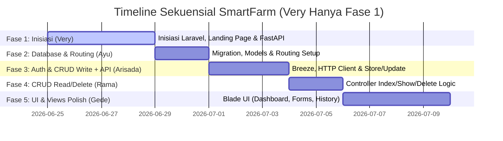

# Pembagian Tugas Kelompok Project SmartFarm (Very Hanya Fase 1)

Dokumen ini berisi pembagian tugas dan fase pengembangan untuk project **SmartFarm: Website Rekomendasi Tanaman dan Segmentasi Kondisi Lahan Berbasis Random Forest dan K-Means**.

Project ini dirancang secara **sekuensial (berurutan/non-paralel)** agar pengerjaan terstruktur, minim konflik Git, dan ramah bagi pemula. Sesuai arahan terbaru, **Very hanya bekerja di Fase 1 (Inisiasi)**. Logika integrasi API (HTTP Client) di Laravel dialihkan ke **Arisada** agar menyatu dengan tugas pembuatan metode `store()` dan `update()` di Controller.

---

## 📅 Alur Pengembangan Sekuensial (Linear Timeline)

---

## 👥 Rincian Fase & Penanggung Jawab

### 🚀 FASE 1: Inisiasi Project & FastAPI ML Service
*   **Penanggung Jawab**: **Very**
*   **Waktu**: Pertama kali (pembuka project).
*   **Deskripsi**: Very bertanggung jawab melakukan inisiasi repository Git kelompok, menyiapkan struktur project Laravel awal, membuat halaman Landing Page, serta membangun backend FastAPI ML Service. Setelah fase ini selesai, tugas Very selesai sepenuhnya.
*   **Daftar Tugas (Checklist)**:
    *   [x] Inisiasi Repository Git kelompok (GitHub/GitLab) dan buat project Laravel awal.
    *   [x] Membuat folder `ml-service/` terpisah di dalam project.
    *   [x] Menyiapkan script FastAPI (`main.py`) untuk memuat model `.pkl` (Random Forest & K-Means) dan membuka endpoint `/predict`.
    *   [x] Membuat file `welcome.blade.php` (Landing Page) di Laravel dengan visual yang informatif mengenai cara kerja SmartFarm, Random Forest, dan K-Means.
    *   [x] Melakukan *commit* dan *push* semua code awal ke Git agar dapat di-clone oleh anggota kelompok lain.

---

### 💾 FASE 2: Database Schema, Eloquent Model, & Routing (Tugas Ayu)
*   **Penanggung Jawab**: **Ayu**
*   **Waktu**: Dimulai setelah **Fase 1 selesai** (Very sudah melakukan push code inisiasi ke Git).
*   **Deskripsi**: Ayu bertugas menyalin kode boilerplate database dan route dari `plan.md` ke dalam project Laravel. Tugas ini sangat sederhana karena tinggal menyalin template kode yang sudah ada.
*   **Daftar Tugas (Checklist)**:
    *   [ ] Menarik (*pull*) repository Git terbaru dari Very.
    *   [ ] Mengonfigurasi file `.env` untuk menghubungkan ke MySQL database lokal.
    *   [ ] Membuat file migration untuk tabel `land_predictions` dengan menyalin (*copy-paste*) kode skema database dari `plan.md` (baris 274-291).
    *   [ ] Menjalankan perintah migration (`php artisan migrate`).
    *   [ ] Membuat Eloquent Model `LandPrediction` dan menyalin kode fillable & relasi user dari `plan.md` (baris 304-327).
    *   [ ] Menambahkan fungsi relasi `landPredictions()` pada file `User.php` dengan menyalin kode dari `plan.md` (baris 329-336).
    *   [ ] Menyalin daftar route web yang sudah terdefinisi dari `plan.md` (baris 359-369) ke dalam file `routes/web.php`.
    *   [ ] Melakukan *push* perubahan ke Git.

---

### 🔑 FASE 3: Sistem Autentikasi, Controller Write & Integrasi API
*   **Penanggung Jawab**: **Arisada**
*   **Waktu**: Dimulai setelah **Fase 2 selesai** (Ayu sudah menyelesaikan migrasi database dan routing).
*   **Deskripsi**: Arisada memasang sistem login/register, menyiapkan logika controller untuk proses input data, serta menembakkan data tersebut ke API FastAPI menggunakan HTTP Client Laravel.
*   **Daftar Tugas (Checklist)**:
    *   [ ] Menarik (*pull*) repository Git terbaru.
    *   [ ] Menginstal dan mengonfigurasi Laravel Breeze untuk otentikasi user (Login, Register, Logout).
    *   [ ] Membuat controller `LandPredictionController` dengan method lengkap (`dashboard`, `index`, `create`, `store`, `show`, `edit`, `update`, `destroy`).
    *   [ ] Menulis logika pada method `dashboard()` di controller untuk menghitung ringkasan data user (total prediksi, prediksi terbaru, dan tanaman terakhir yang direkomendasikan).
    *   [ ] Menulis aturan validasi form input pada method `store()` dan `update()` sesuai spesifikasi (memastikan tipe data numerik dan bernilai positif).
    *   [ ] Menambahkan setting `FASTAPI_URL` ke dalam `.env` dan mendaftarkannya di `config/services.php`.
    *   [ ] Menggunakan Laravel HTTP Client (`Http::post`) pada method `store()` dan `update()` untuk mengirim data input ke FastAPI dan menangkap hasilnya (recommended_crop, cluster, land_type).
    *   [ ] Menyimpan data gabungan (input form + hasil prediksi) ke database MySQL.
    *   [ ] Menambahkan penanganan error (*graceful fallback*) jika API FastAPI mati.
    *   [ ] Melakukan *push* perubahan ke Git.

---

### 🔌 FASE 4: Controller Read/Delete Logic
*   **Penanggung Jawab**: **Rama**
*   **Waktu**: Dimulai setelah **Fase 3 selesai** (Arisada sudah mengunggah integrasi API & store/update ke Git).
*   **Deskripsi**: Rama mengelola logika pengambilan dan penghapusan data riwayat prediksi di database.
*   **Daftar Tugas (Checklist)**:
    *   [ ] Menarik (*pull*) repository Git terbaru.
    *   [ ] Mengisi logika method `index()` pada controller untuk mengambil riwayat prediksi milik user yang sedang login (`LandPrediction::where('user_id', auth()->id())->latest()->get()`).
    *   [ ] Mengisi logika method `show($id)` untuk menampilkan detail data input & output dari satu riwayat.
    *   [ ] Mengisi logika method `destroy($id)` untuk menghapus riwayat prediksi tertentu (`$prediction->delete()`).
    *   [ ] Melakukan *push* perubahan ke Git.

---

### 🎨 FASE 5: Pembuatan UI & Estetika Blade Views
*   **Penanggung Jawab**: **Gede**
*   **Waktu**: Dimulai setelah **Fase 4 selesai** (Seluruh integrasi backend dan database dari Rama sudah selesai).
*   **Deskripsi**: Gede bertugas mendesain seluruh tampilan halaman (*views*) agar tampak premium, bersih, responsif, dan konsisten.
*   **Daftar Tugas (Checklist)**:
    *   [ ] Menarik (*pull*) repository Git terbaru.
    *   [ ] Membuat Master Layout (`layouts/app.blade.php`) dengan sidebar/navbar navigasi yang konsisten.
    *   [ ] Membuat UI Dashboard (`dashboard.blade.php`) yang menampilkan rangkuman statistik user.
    *   [ ] Membuat UI Form Input Prediksi (`predictions/create.blade.php`) dan Form Edit (`predictions/edit.blade.php`) beserta penanganan error validasi visual.
    *   [ ] Membuat UI tabel Riwayat Prediksi (`predictions/index.blade.php`) dan halaman detail hasil prediksi (`predictions/show.blade.php`).
    *   [ ] Memoles CSS/Tailwind dengan skema warna pertanian modern (hijau segar), tombol interaktif, dan efek transisi/hover.
    *   [ ] Melakukan *push* akhir ke Git untuk pengujian kelompok secara menyeluruh.
